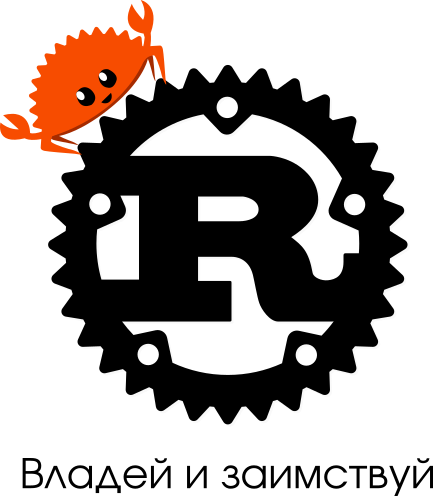

Что делает Rust универсальным языком программирования
=====================================================



Долгое время Rust позиционировался исключительно как язык для системного программирования. Попытки использовать Rust для высокоуровневых прикладных задач зачастую вызывали усмешку у значительной части сообщества: зачем использовать инструмент в том качестве, на которое он не рассчитан? Какая польза от возни с типами и анализатором заимствований (borrow checker), если есть Python и Java со сборкой мусора? Но другая часть сообщества всегда видела потенциал Rust именно как языка прикладного, и даже находила его удобным в использовании для быстрого прототипирования - во многом благодаря его особенностям, а не вопреки им.

Шло время, и сейчас использование Rust для высокоуровневых прикладных задач вызывает куда меньше споров, чем раньше. Сообщество накопило практический опыт, и практика показала, что у Rust есть свои преимущества в прикладной сфере. Посмотрите, как менялось официальное определение языка, с [такого](https://prev.rust-lang.org/en-US/):

> Rust is a systems programming language that runs blazingly fast, prevents segfaults, and guarantees thread safety.

> Rust — невероятно быстрый язык для системного программирования без segfault'ов и с гарантиями потокобезопасности.

на [такое](https://www.rust-lang.org/):

> A language empowering everyone to build reliable and efficient software.

> Язык, позволяющий каждому создавать надёжное и эффективное программное обеспечение.

Думаю, это хорошая иллюстрация смещения акцентов в позиционировании языка.

В данной статье я хочу рассказать о важных аспектах языка Rust, которые делают его универсальным, то есть равно успешно применимым и в системном, и в прикладном программировании. Более того, попытаюсь показать, как Rust устанавливает органичную связь между этими, казалось бы независимыми и даже противоположными сферами.


## Что понимать под высоким и низким уровнем?

Понятия высокого/низкого уровня, применительно к языкам программирования, уже давно перестали носить абсолютный характер. По сравнению с ассемблером, язык Си - высокоуровневый, а по сравнению с Haskell - низкоуровневый. В случае с Rust ситуация усугубляется тем, что некоторые языковые возможности в нем близки к Haskell, а некоторые - к Си. Чтобы не запутаться, что считать высоким уровнем, а что низким, я предлагаю использовать простое правило: если языковая конструкция скорее выражает **что** мы делаем в терминах самой задачи, то она более высокого уровня, чем та, которая скорее говорит нам **как именно** реализуется решение.

Интересно, что с этой точки зрения декларативный подход выше уровнем, чем императивный. Также понятно, что для системного программирования особо важно, чтобы язык мог выражать **как** нечто работает в системе, потому что именно это **как** напрямую и есть **что** главной задачи системного программирования. Можно сказать, что низкоуровневый по отношению к множеству разных задач язык программирования может являться одновременно высокоуровневым предметно-ориентированным языком (DSL) для сугубо системных задач, так как лучшим образом отражает архитектуру системы.


## unsafe-блоки

Давайте сразу обратимся к примеру и посмотрим, как в Rust работают итераторы:

```rust
let a: Vec<_> = [1, 2, 3].iter().filter(|&i| i % 2 != 0).map(|i| i * 2).collect();
```
[запустить](https://play.rust-lang.org/?version=stable&mode=debug&edition=2018&gist=13b57fdaf59b6539106ef376070edb0d)

Здесь мы создаем массив из трех элементов, затем получаем итератор на него и добавляем к нему два адаптера - `filter` и `map`, после чего собираем итератор в новую коллекцию типа `Vec`. Этот код - достаточно высокоуровневый и довольно типичный для многих высокоуровневых языков (таких как JavaScript). Но давайте теперь посмотрим, как реализован объект типа `Iter`, который мы получаем в результате вызова метода `.iter()`:

```rust
pub struct Iter<'a, T: 'a> {              // 1
    ptr: NonNull<T>,                      // 2
    end: *const T,                        // 3
    _marker: marker::PhantomData<&'a T>,  // 4
}

impl<'a, T> Iterator for Iter<'a, T> {
    type Item = &'a T;

    #[inline]
    fn next(&mut self) -> Option<&'a T> {
        unsafe {                          // 5
            assume(!self.ptr.as_ptr().is_null());
            if mem::size_of::<T>() != 0 {
                assume(!self.end.is_null());
            }
            if is_empty!(self) {
                None
            } else {
                Some(next_unchecked!(self))
            }
        }
    }
    
    ...
}
```
[std::slice::Iter](https://doc.rust-lang.org/std/slice/struct.Iter.html)

Обратите внимание, что структура `Iter` содержит в качестве своих полей два указателя: `ptr` и `end` (строки 2 и 3). Из-за того, что эти указатели - это обычные Си-совместимые указатели (правда `NonNull` дополнительно требует, чтобы указатель не был нулевым), довольно низкоуровневые ссылочные типы, их время жизни никак не отслеживается borrow checker'ом. Поэтому заданное в объявлении структуры время жизни ссылки `'a` (1) мы вынуждены добавить в "фантомное" поле с типом нулевой размерности `PhantomData<&'a T>` (4). Иначе время жизни окажется никак не используемым внутри структуры, что приведет к ошибке компиляции. То есть, другими словами: мы хотим сделать безопасный итератор, который ссылается на элементы коллекции, по которой он итерируется, и для того, чтобы он был безопасным, нам нужно учитывать время жизни ссылок. Но наша внутренняя реализация основана на указателях и потому не подразумевает никакого отслеживания времен жизни со стороны компилятора. Поэтому мы должны гарантировать своей реализацией безопасность кода, работающего с указателями (в unsafe-блоках, подобных 5), и тогда можно реализовать безопасный внешний API по всем правилам работы в safe Rust.

Это очень наглядный пример того, что представляет собой Rust на самом деле. Это высокоуровневый, безопасный язык, в котором есть низкоуровневые небезопасные возможности. Тут граница, по которой одно отделяется от другого - это определение типа, а блоки unsafe выступают маркером того, что в реализации используются весьма низкоуровневые и небезопасные средства (на самом деле в общем случае граница проходит через определение модуля: пока в язык не будет добавлена возможность помечать поля как unsafe, потенциально небезопасным становится весь код в пределах модуля, если на поведение unsafe-методов влияет содержимое полей структуры).

Важный вывод, к которому мы здесь приходим, состоит в том, что Rust - самодостаточный язык. Его высокоуровневые возможности вполне реализуются на низком уровне им же самим. И наоборот: из низкоуровневых "кирпичей" в Rust можно конструировать высокоуровневые блоки, скрывая детали реализации за безопасным API.

Теперь должно быть понятно, что unsafe, который тут и там встречается в стандартной библиотеке Rust - это не баг, а фича. Есть довольно популярный упрек к Rust со стороны: дескать, какой же это безопасный и высокоуровневый язык, если у него в `std` сплошные unsafe-блоки? Он либо тогда должен быть весь unsafe, либо полностью safe. Но преимущество Rust как раз состоит в том, что он позволяет делать и то и другое, при этом отделяя одно от другого. Это одна из причин, почему Rust по-настоящему универсальный язык программирования.


## Макросы

Посмотрите, как организуется простейший цикл `for` на Python:

```python
for x in range(5):
  print(x)
```

Сравните с Rust:

```rust
for x in 0..5 {
    println!("{}", x);
}
```
[запустить](https://play.rust-lang.org/?version=stable&mode=debug&edition=2018&gist=f5aaea327894475ba1be87ab88420386)

Они похожи, не правда ли? Но `for` в Rust - это просто синтаксический сахар к более низкоуровневому представлению. Вот во что разворачивается данный цикл `for`:

```rust
match IntoIterator::into_iter(0..5) {
    mut iter => loop {
        let next;
        match iter.next() {
            Some(val) => next = val,
            None => break,
        };
        let x = next;
        let () = {
            println!("{}", x);
        };
    },
}
```
[for Loops and IntoIterator](https://doc.rust-lang.org/std/iter/index.html#for-loops-and-intoiterator)

Отсюда понятно, что на место диапазона `0..5` в исходном `for` можно подставить любое значение, которое реализует трейт `IntoIterator`, а на место `x` - все, что допустимо в левой части инструкции `let`. Зная это, давайте реализуем с помощью макроса собственную версию цикла `for`, которая будет возвращать значение своего тела на последней итерации как опциональный результат всего цикла:

```rust
macro_rules! foret {
    ($x:pat in $exp:expr => $body:expr) => {{
        let mut result = None;
        match IntoIterator::into_iter($exp) {
            mut iter => loop {
                let next;
                match iter.next() {
                    Some(val) => next = val,
                    None => break result,
                };
                let $x = next;
                result = Some($body);
            },
        }
    }}
}
```

```rust
let result = foret!(x in 0..5 => {
    println!("{}", x);
    x
});

assert_eq!(result, Some(4));
```
[запустить](https://play.rust-lang.org/?version=stable&mode=debug&edition=2018&gist=85a354e2c441738132d6b598a200d968)

Макросы в Rust - декларативные и процедурные - позволяют строить синтаксические абстракции для собственных высокоуровневых предметно-ориентированных языков. В данном случае мы создали декларативный макрос `foret`. Такие макросы являются гигиеничными и они устроены достаточно просто, но эта простота накладывает некоторые ограничения на допустимый синтаксис: после фрагмента `expr` (который сопоставляется любому допустимому в Rust выражению) мы должны обязательно поставить разделитель, поэтому там и появилась стрелочка `=>`. Процедурные макросы избавлены от подобных ограничений, они могут работать с любым синтаксисом, но они чуть сложнее в реализации.

Касательно процедурных макросов: забавно, как возможность делать низкоуровневые вещи открывает языку путь к построению предельно высокоуровневых абстракций. Дело в том, что процедурные макросы в Rust - это своего рода "плагины к компилятору", которые пишутся на самом Rust. Так как Rust - это язык без сборщика мусора, то он может использоваться для создания встраиваемых компонентов. В частности, можно написать динамическую библиотеку, которую подгрузит компилятор при компиляции вашей программы, и которая будет реализовывать ваши собственные расширения языка. Взглянем на пример использования атрибутных процедурных макросов в [`actix-web`](https://github.com/actix/actix-web):

```rust
use std::io;
use actix_web::{get, web, App, HttpServer, Responder};

#[get("/{id}/{name}/index.html")]
async fn index(info: web::Path<(u32, String)>) -> impl Responder {
    format!("Hello {}! id:{}", info.1, info.0)
}

#[actix_rt::main]
async fn main() -> io::Result<()> {
    HttpServer::new(|| App::new().service(index))
        .bind("127.0.0.1:8080")?
        .run()
        .await
}
```

Здесь `#[get(..)]` и `#[actix_rt::main]` - это пользовательские атрибуты, которые приведут при компиляции к преобразованию элементов, на которые они навешены, в соответствии с заданной программой. Вот во что развернется код выше при компиляции:

```rust
use std::io;
use actix_web::{get, web, App, HttpServer, Responder};

#[allow(non_camel_case_types, missing_docs)]
pub struct index;

impl actix_web::dev::HttpServiceFactory for index {
    fn register(self, __config: &mut actix_web::dev::AppService) {
        async fn index(info: web::Path<(u32, String)>) -> impl Responder {
            {
                let res = ::alloc::fmt::format(::core::fmt::Arguments::new_v1(
                    &["Hello ", "! id:"],
                    &match (&info.1, &info.0) {
                        (arg0, arg1) => [
                            ::core::fmt::ArgumentV1::new(arg0, ::core::fmt::Display::fmt),
                            ::core::fmt::ArgumentV1::new(arg1, ::core::fmt::Display::fmt),
                        ],
                    },
                ));
                res
            }
        }
        let __resource = actix_web::Resource::new("/{id}/{name}/index.html")
            .name("index")
            .guard(actix_web::guard::Get())
            .to(index);
        actix_web::dev::HttpServiceFactory::register(__resource, __config)
    }
}

fn main() -> io::Result<()> {
    actix_rt::System::new("main").block_on(async move {
        {
            HttpServer::new(|| App::new().service(index))
                .bind("127.0.0.1:8080")?
                .run()
                .await
        }
    })
}
```

Функция `index` превратилась в структуру с реализацией типажа `HttpServiceFactory`, а в теле функции `main` появился код по запуску рантайма для работы с асинхронным кодом.

Другой пример - макрос `html` библиотеки [`yew`](https://github.com/yewstack/yew), который позволяет совмещать Rust-код с html-подобным DSL для создания Web-интерфейсов:

```rust
impl Component for Model {
    ...

    fn view(&self) -> Html {
        html! {
            <div>
                <button onclick = self.link.callback(|_| Msg::Click)>{ "Click" }</button>
            </div>
        }
    }
}
```

Здесь макрос позволяет указать разметку в привычном виде, декларативно, на html-подобном языке, с вкраплениями Rust-кода. Похоже на JSX, расширение языка JavaScript. Только Rust изначально обладает средствами для создания подобных расширений, для него они - обычное дело.

Возможности процедурных макросов практически безграничны. Правда, вам самим придется заботиться о семантике, так как макросы работают на синтаксическом уровне, а рефлексии в Rust не предусмотрено. Тем не менее, грамотно написанные макросы могут сильно упростить создание абстракций, специфичных для конкретной предметной области. Таким образом, сам Rust становится низкоуровневым инструментом реализации требуемого высокоуровнего предметно-ориентированного языка, предельно соответствующего решаемой задаче.

В отличие от некоторых высокоуровневых языков (таких как Python), которые служат своего рода "клеем" для низкоуровневых компонентов, написанных на других языках, Rust сам выступает и в роли "клея", и в роли инструмента реализации "склеиваемых" компонентов.


## Бесплатные абстракции

Удивительно, насколько наличие абстракций с нулевой стоимостью, даже самых элементарных, упрощает прикладную разработку. Посмотрите на следующий код, который написан на языке, считающимся высокоуровневым:

```php
sleep(5);
```

И сравните с тем, как то же самое поведение реализуется в Rust:

```rust
use std::{thread, time::Duration};

thread::sleep(Duration::from_secs(5));
```

Где вам понятнее, что происходит и где, по-вашему, вероятность ошибиться меньше? Мне кажется, что ответ очевиден.

Помимо демонстрации отличного дизайна стандартной библиотеки, этот пример показывает, насколько Rust может быть удобен для высокоуровневого программирования: вместо того, чтобы принимать в свои функции непонятные числа, вы можете использовать собственные типы, созданные под конкретную задачу, и это без дополнительных накладных расходов. (Правда, в случае структуры с несколькими полями, как у `Duration`, по-умолчанию будет производиться выравнивание, но это поведение можно менять с помощью атрибута `repr`.)

Числовой тип - это "низкоуровневый" тип, потому что он отвечает на вопрос **как** значение будет представлено в памяти, а не на вопрос **что** оно собой представляет в контексте задачи. Но в Rust можно очень легко и элегантно вводить новые типы поверх существующих:

```rust
struct Celsius(f64);

struct Fahrenheit(f64);

let a = Celsius(5.);
let b = Fahrenheit(5.);
```
[запустить](https://play.rust-lang.org/?version=stable&mode=debug&edition=2018&gist=be1b359b536766e79896b44c00adb85b)

Несмотря на то, что оба значения `a` и `b` имеют одинаковое числовое представление, они являются объектами разных типов, и поэтому перепутать и подставить одно значение вместо другого не получится. Этот паттерн называется "Новый тип" (New type), и он совершенно бесплатен в использовании. (Подробнее о преимуществах использования паттерна "Новый тип" вы можете прочитать в замечательной статье [Передача намерений](https://habr.com/ru/post/326896/).)

"Новый тип", так же как и вообще любая пользовательская структура или перечисление в Rust, может выступать границей раздела нескольких уровней программирования. И чтобы пользователь мог переходить эту границу всегда, когда это удобно для решения его задачи, эти абстракции не должны сами по себе требовать сколь-либо значимых дополнительных расходов. Иначе пользователь будет вынужден чаще пользоваться имеющимися низкоуровневыми типами, вместо того, чтобы создавать на их основе свои, высокоуровневые.


## Обобщенные типы

Помимо того, что обобщенные типы избавляют от написания шаблонного кода, они являются отличным инструментом абстрагирования и высокоуровневой спецификации поведения. Вот что я имею ввиду:

```rust
fn min<T: PartialOrd>(a: T, b: T) -> T {
    if b < a { b } else { a }
}
```
[запустить](https://play.rust-lang.org/?version=stable&mode=debug&edition=2018&gist=00b11c4a381a4d3b1f29faf182770f24)

Тут уже сразу по сигнатуре функции понятно, что мы можем принять в аргументах объекты одного и того же типа `T`, для которого реализовано отношение частичного порядка. Таким образом, от указания конкретного типа, мы переходим к указанию неких характеристик используемого типа с помощью типажей (traits), которые могут быть присущи самым разным типам. Можно указывать и достаточно нетривиальные зависимости между типами. Однако сами по себе характеристики, ровно как и соответствующие им типажи, могут быть как высокоуровневыми, так и низкоуровневыми. То есть они могут характеризовать тип как со стороны требований решаемой задачи, так и со стороны требований реализации. Вот небольшой пример из стандартной библиотеки:

```rust
pub struct HashMap<K, V, S = RandomState> {
    ...
}

impl<K, V, S> HashMap<K, V, S>
where
    K: Eq + Hash,
    S: BuildHasher,
{
    ...
    pub fn get<Q: ?Sized>(&self, k: &Q) -> Option<&V>
    where
        K: Borrow<Q>,
        Q: Hash + Eq,
    {
        self.base.get(k)
    }
    ...
}
```
[std::collections::HashMap](https://doc.rust-lang.org/std/collections/struct.HashMap.html)

Метод `get` хеш-таблицы, хранящей значения типа `V`, соответствующие ключам типа `K`, принимает ссылку некоторого типа `Q`, которую также можно получить из ссылки на ключ (это правило задано отношением `K: Borrow<Q>`). Что это значит? Это значит, что для случая, например, строковых ключей (`K = String`) вместо того, чтобы всякий раз передавать в `get` ссылку на владеющую строку (`&Q = &K = &String`), вы можете, скажем, передавать строковый срез (`&Q = &str`), к которому можно привести ссылку на владеющую строку с помощью операции `Borrow`. Это позволяет избежать лишних аллокаций и просто повышает удобство использования: вызывающий код не должен думать, какую именно строку передавать - метод `get` корректно сработает для обоих вариантов.

Выглядит как что-то низкоуровневое. Но такое поведение часто реализует определенное требование самой задачи. Например, у нас есть тип с приватным конструктором:

```rust
pub struct UserId(u32);
```

Можно сделать так, что `UserId` будет возможно сконструировать только с помощью некоего сервиса, который либо выдает новое число из глобальной последовательности идентификаторов, либо десериализует значение `UserId` из ранее сконструированного и сохраненного. (Подробнее о преимуществах подобного подхода к проектированию типов вы можете прочитать в статье [Парсите, а не валидируйте](https://habr.com/ru/post/498042/).)

Теперь мы хотим использовать `UserId` как ключ в хеш-таблице, и это хорошо, так как у нас в таком случае появляется гарантия, что значение `UserId` когда-то было корректно сконструировано и добавлено в таблицу, других вариантов его получить нет. Но мы должны иметь возможность обращаться к значению также и по ключу типа `u32`! Потому что принятое число, например от пользователя, может оказаться верным значением идентификатора, а может и нет, и мы не хотим всякий раз делать сложную проверку его корректности, нам достаточно того, можем мы получить значение из хеш-таблицы по этому ключу, или не можем. Такое поведение легко осуществить, если мы реализуем соответствующий `Borrow`:

```rust
impl Borrow<u32> for UserId {
    fn borrow(&self) -> &u32 {
        &self.0
    }
}
```
[запустить](https://play.rust-lang.org/?version=stable&mode=debug&edition=2018&gist=eb8212df5a0932b956144f320c889db9)

Вернемся к определению метода `get`. Для типа `Q` там представлено также одно весьма низкоуровневое ограничение - `Q: ?Sized`. Оно говорит о том, что тип `Q` не обязательно должен быть типом с известным размером на этапе компиляции (что задано по умолчанию для обобщенных типов). Так как в метод передается только ссылка на этот тип, сам тип может быть и типом с неизвестным размером. Размеры типов принимаемых и возвращаемых значений у функций всегда должны быть известны на этапе компиляции, иначе будет невозможно зарезервировать для них место на стеке.

Итак, на границе высокоуровневого и низкоуровневого кода, проходящей через определения обобщенных типов, мы можем столкнуться как с высокоуровневыми, так и с низкоуровневыми ограничениями, причем далеко не всегда просто отделить одни от других. Но помочь с этим может введение новых типажей:

```rust
pub trait AsMapKey: ?Sized + Hash + Eq {}

impl<T: ?Sized + Hash + Eq> AsMapKey for T {}
```

Теперь можно вместо набора из трех ограничений писать только одно, которое автоматически будет выполняться для всякого типа, имеющего исходные три характеристики. Таким образом можно скрыть множество низкоуровневых требований за одним высокоуровневым. 


## Перечисление типов

В Rust есть тип-перечисление `enum`, который в отличии от перечислений в других языках, является перечислением не константных значений одного типа, а перечислением разных типов, которые может принимать значение. Это - алгебраический тип данных (АТД), простой и выразительный инструмент для конструирования высокоуровневых абстракций.

Хороший пример АТД - это тип `Value` библиотеки [`serde_json`](https://github.com/serde-rs/json), который представляет любое корректное JSON-значение:

```rust
pub enum Value {
    Null,
    Bool(bool),
    Number(Number),
    String(String),
    Array(Vec<Value>),
    Object(Map<String, Value>),
}
```
[`serde_json::Value`](https://docs.serde.rs/serde_json/enum.Value.html)

АТД во многих случаях избавляет программиста от написания низкоуровневого кода для проверки целостности и непротиворечивости типов данных. Что актуально не только для языков с динамической типизацией, но и для статически типизированных языков. 

Вообще, `enum` в Rust используется чуть менее, чем везде - и это прекрасно! Потому что АТД - это абстракция очень высокого уровня, сравнимая с наследованием классов и полиморфизмом подтипов в ООП. Выражение традиционно низкоуровневых концепций в терминах АТД неожиданно делает их не такими уж и низкоуровневыми.

Классический пример - это реализация отсутствующего значения. Во многих языках прошлого поколения в качестве отсутствующего зачения используется `null`. И это очень плохо, потому что `null` - это и тип, и значение, которое к тому же могут принимать переменные совершенно разных типов. Один `null` от другого не отличим и мы всегда должны иметь ввиду, что наш объект может оказаться `null` в любом месте програмы вне зависимости от его типа и от того, вообще требуется ли для данного типа иметь отсутствующее значение (конечно это касается только ссылочных типов, которые используются в популярных ныне высокоуровневых языках неявно).

Вот как решается проблема реализации отсутствующего значения в Rust:

```rust
pub enum Option<T> {
    None,
    Some(T),
}
```
[std::option::Option](https://doc.rust-lang.org/std/option/enum.Option.html)

С таким подходом можно убрать `null` из безопасной части языка совсем. Концептуально и просто, теперь сам `Option` опционален и вписан в существующую систему типов как абстракция более высокого уровня, равно применимая к любым типам, не только к ссылочным. "Под капотом", в реализации, ссылочные типы все равно имеют `null`, поэтому для таких типов использование `Option` не влечет накладных расходов: `Option::None` представляется как `null` и дополнительного места для хранения дискриминанта не требуется. Так что и для низкоуровневых системных задач `Option` применим.

Подробнее об АТД и преимуществах их использования, вы можете прочитать в статье Романа Душкина ["Алгебраические типы данных и их использование в программировании"](http://fprog.ru/2009/issue2/roman-dushkin-algebraic-data-types/).


## Владение

Концепция владения в Rust постулирует единственность владельца ресурса в любой момент времени. Она вводилась для решения проблемы гонки данных при конкурентном доступе и проблемы использования памяти после освобождения. Однако кроме этого, концепция владения позволила легко реализовать механизм автоматического освобождения ресурсов, где ресурсом может выступать не только память, но также файлы, сокеты и любые другие пользовательские объекты. Если владелец ресурса всегда один, то когда он выходит из области видимости и уничтожается - ресурс автоматически освобождается. Пользователь может задавать собственную процедуру освобождения, реализуя типаж `Drop` для своего типа.

В Java, например, с `try-with-resources` ответственность за корректное освобождение ресурсов перекладывается на вызывающую сторону. К тому же не всегда использование ресурсов настолько локализовано, что безошибочное использование `try-with-resources` очевидно. Использование `Cleaner` улучшает ситуацию и избавляет пользователя от необходимости следить за освобождением в тривиальных случаях, но в более сложных - головной боли не избежать (подробнее о проблемах освобождения ресурсов в Java смотрите в лекции Евгения Козлова ["Вы все еще используете finalize()? Тогда мы идем к вам"](https://youtu.be/K5IctLPem0c)).

Rust же предоставляет простой и элегантный механизм, который основан на универсальной в рамках языка концепции владения, избавляющий программиста от необходимости низкоуровневого кодирования освобождения памяти и прочих ресурсов в местах их использования.

Дополнительно, с концепцией владения тесно связан принцип перемещения по-умолчанию: если вы передаете владельца из одного места в другое, то ресурс будет перемещен (логически), а не скопирован. Это удобно использовать при реализация всевозможных переходов, например, между состояниями абстрактного автомата:

```rust
mod machine {
    pub struct StateA(String);
    
    pub struct StateB(String);
    
    pub struct StateC(String);

    pub fn start(data: impl Into<String>) -> StateA {
        StateA(data.into())
    }
    
    impl StateA {
        pub fn step(self) -> StateB {
            StateB(self.0)
        }
    }

    impl StateB {
        pub fn step(self) -> StateC {
            StateC(self.0)
        }
    }
}

let a = machine::start("Hello");
let c = a.step().step();
```
[запустить](https://play.rust-lang.org/?version=stable&mode=debug&edition=2018&gist=2d4a18bee02fdd79ac8794541413a447)

Вне модуля `machine` значение типа `StateC` невозможно получить никаким другим способом, кроме как из значения типа `StateA`, путем вызова метода `step` два раза, с переходом через состояние `StateB`. Причем вызвать `step` на конкретном значении возможно только один раз.

Реализация подобного сценария желательна не так уж и редко, а в некоторых случаях [она крайне необходима](https://youtu.be/16k_P3mxu1Q?t=3363). Так что с помощью системы владения Rust защита последовательности смены состояний становится достаточно простым делом.


## Заимствование

На низком уровне заимствование означает получение ссылки на объект, время жизни которой компилятор проверит на соответствие времени жизни исходного объекта. Но при взгляде с более высокого уровня, заимствование означает получение некоего представления (view), временно соотнесенного с исходным объектом. Такое представление не обязано быть единственным.

Например, для стандартного типа `String`, благодаря реализации типажа `Deref`, при использовании операции заимствования мы можем получить одно из двух различных представлений: это ссылку на владеющую строку `&String` или строковый срез `&str`. Дополнительно, благодаря реализации типажа `AsRef`, вызвав у владеющей строки метод `as_ref` можно получить ее представление как байтовый срез `&[u8]`, как заимствование платформо-специфичной строки `&OsStr` или как заимствованное представление пути `&Path`. При этом `OsStr` можно получить как из `String`, так и из `OsString` (для работы с которым он прежде всего предназначен). При этом `Path` конструируется из `OsStr` следующим образом:

```rust
pub struct Path {
    inner: OsStr,
}

impl Path {
    pub fn new<S: AsRef<OsStr> + ?Sized>(s: &S) -> &Path {
        unsafe { &*(s.as_ref() as *const OsStr as *const Path) }
    }
    ...
}
```
[`std::path::Path source`](https://doc.rust-lang.org/src/std/path.rs.html#1723-1775)

Неплохо, правда? То есть, `Path::new` принимает ссылку на значение любого типа, который представим как `&OsStr`, и преобразует `&OsStr` в `&Path` напрямую, через кастинг указателей, к которым можно преобразовать эти ссылки (это безопасно в связи с идентичным внутренним представлением `OsStr` и `Path`). Таким образом, конструктор `Path::new` не конструирует никакого нового объекта, он просто преобразует заимствование одного типа в заимствование другого типа. `String` можно преобразовать в `Path` именно потому, что `String` заимствуется как `OsStr`, а он в свою очередь имеет такое же физическое представление, как и `Path`.

Существует много полезных типов-заимствований, в Rust они используются повсеместно. Скажем, итератор, пример которого показан в самом начале статьи. Или различные пользовательские DTO-типы, которые принято использовать для записи объектов в базу данных с помощью `diesel`. Концепция заимствования в Rust - это нечто большее, чем просто работа со ссылкой на конкретный тип, она позволяет на более высоком уровне создавать различные типы-представления, альтернативные интерпретации одного и того же объекта, разные логические стороны которого зависят и ссылаются на данные исходного владеющего типа.


## Что же в итоге?

Как видите, Rust - это не просто очередной системный язык программирования по мотивам Си. На системный язык, обогащенный рядом высокоуровневых концепций, можно смотреть и с другой стороны: как на прикладной язык, снабженный низкоуровневым инструментарием.

Полезны ли эти низкоуровневые инструменты в прикладной раработке? Я думаю, что да. Они позволяют создавать новые эффективные высокоуровневые абстракции, расширяя арсенал разработчика. Дополнительно, наличие средств, которые позволяют изолировать и связывать между собой разные уровни, делают Rust по-настоящему универсальным языком программирования.

Полагаю, что качество Rust-кода и удобство его доработки будет напрямую зависеть от того, насколько удачно программист решил проблему инкапсуляции низких уровней относительно высоких в рамках своей задачи. Конечно, тут у Rust еще большой простор для совершенствования, но имеющихся средств уже достаточно, чтобы довольно комфортно вести прикладную, высокоуровневую разработку, а не только решать низкоуровневые системные задачи.


-----------------------------------------------------------------

## Мутабельность и иммутабельность
- информация об изменениях заранее
- больше информации в сигнатуре
- нет необходимости в синхронизации методов

## Умные указатели
// ## "Ручное" управление памятью

## Преобразование при разыменовании


Вот несколько примеров типичного использования АТД в стандартной библиотеке Rust:

1. Представление вариантов выравнивания:

```rust
pub enum Alignment {
    Left,
    Right,
    Center,
}
```

2. Представление IP-адреса, значение может иметь тип `Ipv4Addr` или `Ipv6Addr`:

```rust
pub struct Ipv4Addr { ... }

pub struct Ipv6Addr { ... }

pub enum IpAddr {
    V4(Ipv4Addr),
    V6(Ipv6Addr),
}
```

3. Представление произвольного значения, которое может отсутствовать:

```rust
pub enum Option<T> {
    None,
    Some(T),
}
```

4. Представление произвольного результата, который может быть успешным или ошибочным:

```rust
pub enum Result<T, E> {
    Ok(T),
    Err(E),
}
```


Кроме того, при сопоставлении с образцом компилятор статически проверяет, что все возможные варианты значений АТД обработаны:

```rust
#[derive(Debug)]
enum Message {
    Quit,
    Move { x: i32, y: i32 },
    Write(String),
    ChangeColor(u8, u8, u8),
}

fn process(msg: Message) {
    match msg {
        Message::Move { x, y } => ,
        Message::Write(content) => ,
        Message::ChangeColor(red, 0, 0) => ,
        color @ Message::ChangeColor(..) => ,
        msg => ,
    }
}
```
